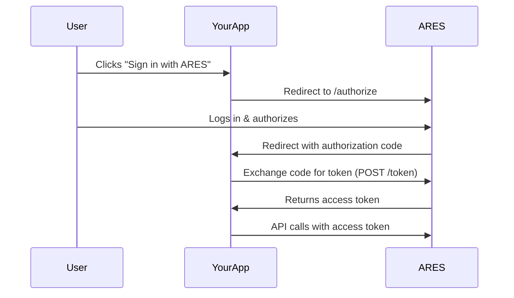

## Overview

This guide shows you how to implement the ARES OAuth 2.0 authorization flow manually, without using Clerk or Auth0. This approach gives you maximum control and flexibility.

<Warning>
  Custom OAuth implementation requires more development work and careful security considerations. Consider using [Clerk](/authentication/clerk) or [Auth0](/authentication/auth0) unless you have specific requirements.
</Warning>

## When to Use Custom OAuth

Consider implementing custom OAuth when you:
- Have an existing authentication system
- Need complete control over the OAuth flow
- Want to minimize third-party dependencies
- Have specific security or compliance requirements
- Are integrating with a non-standard framework

## OAuth 2.0 Authorization Code Flow

ARES uses the standard OAuth 2.0 Authorization Code flow:



## ARES OAuth Endpoints

| Endpoint | URL | Method | Purpose |
|----------|-----|--------|---------|
| **Authorization** | `https://joinares.com/oauth` | GET | Start OAuth flow |
| **Token Exchange** | `https://oauth.joinares.com/oauth/token` | POST | Exchange code for token |
| **User Info** | `https://oauth.joinares.com/v1/user` | GET | Get user profile |

<Note>
  After receiving your Client ID and Secret, you must email your redirect URI to **admin@joinares.com** for verification before production use.
</Note>

## Step 1: Register as Partner

Before implementing OAuth, you need partner credentials:

1. Contact **admin@joinares.com** to register as an ARES partner
2. Receive your **Partner Client ID** and **Partner Client Secret**
3. Provide your **Redirect URI(s)** (e.g., `https://yourapp.com/auth/callback`)

<Note>
  Save your Client Secret securely. It should never be exposed in client-side code or committed to version control.
</Note>

## Step 2: Initiate Authorization

When a user wants to sign in with ARES, redirect them to the authorization endpoint:

### Authorization URL Structure

```
https://joinares.com/oauth?
  client_id=YOUR_CLIENT_ID&
  redirect_uri=YOUR_REDIRECT_URI&
  response_type=code&
  scope=profile email&
  state=RANDOM_STATE_STRING
```

### Parameters

| Parameter | Required | Description |
|-----------|----------|-------------|
| `client_id` | Yes | Your ARES Partner Client ID |
| `redirect_uri` | Yes | URL to redirect after authorization (must match registered URI) |
| `response_type` | Yes | Must be `code` for authorization code flow |
| `scope` | Yes | Permissions requested: `profile email` |
| `state` | Recommended | Random string to prevent CSRF attacks |

### Example Implementation

<CodeGroup>

```typescript Next.js API Route
// app/api/auth/ares/login/route.ts
import { NextRequest } from 'next/server';
import crypto from 'crypto';

export async function GET(request: NextRequest) {
  // Generate random state for CSRF protection
  const state = crypto.randomBytes(16).toString('hex');

  // Store state in session/cookie to verify later
  // (implementation depends on your session management)
  // await saveState(state);

  const authUrl = new URL('https://joinares.com/oauth');
  authUrl.searchParams.set('client_id', process.env.ARES_CLIENT_ID!);
  authUrl.searchParams.set('redirect_uri', `${process.env.APP_URL}/api/auth/ares/callback`);
  authUrl.searchParams.set('response_type', 'code');
  authUrl.searchParams.set('scope', 'profile email');
  authUrl.searchParams.set('state', state);

  return Response.redirect(authUrl.toString());
}
```

```typescript Express.js
// routes/auth.js
import express from 'express';
import crypto from 'crypto';

const router = express.Router();

router.get('/auth/ares/login', (req, res) => {
  const state = crypto.randomBytes(16).toString('hex');

  // Store state in session
  req.session.oauthState = state;

  const authUrl = new URL('https://joinares.com/oauth');
  authUrl.searchParams.set('client_id', process.env.ARES_CLIENT_ID);
  authUrl.searchParams.set('redirect_uri', `${process.env.APP_URL}/auth/ares/callback`);
  authUrl.searchParams.set('response_type', 'code');
  authUrl.searchParams.set('scope', 'profile email');
  authUrl.searchParams.set('state', state);

  res.redirect(authUrl.toString());
});

export default router;
```

</CodeGroup>

## Step 3: Handle Authorization Callback

After the user authorizes your app, ARES redirects back to your redirect URI with an authorization code:

```
https://yourapp.com/auth/callback?
  code=AUTHORIZATION_CODE&
  state=SAME_STATE_STRING
```

### Verify State Parameter

<Warning>
  Always verify the `state` parameter matches what you sent to prevent CSRF attacks.
</Warning>

### Exchange Code for Access Token

Make a POST request to the token endpoint:

<CodeGroup>

```typescript Next.js
// app/api/auth/ares/callback/route.ts
import { NextRequest } from 'next/server';

export async function GET(request: NextRequest) {
  const searchParams = request.nextUrl.searchParams;
  const code = searchParams.get('code');
  const state = searchParams.get('state');

  // Verify state parameter
  // const savedState = await getState();
  // if (state !== savedState) {
  //   return Response.json({ error: 'Invalid state' }, { status: 400 });
  // }

  if (!code) {
    return Response.json({ error: 'No authorization code' }, { status: 400 });
  }

  try {
    // Exchange authorization code for access token
    const tokenResponse = await fetch('https://oauth.joinares.com/oauth/token', {
      method: 'POST',
      headers: {
        'Content-Type': 'application/x-www-form-urlencoded',
      },
      body: new URLSearchParams({
        grant_type: 'authorization_code',
        code: code,
        redirect_uri: `${process.env.APP_URL}/api/auth/ares/callback`,
        client_id: process.env.ARES_CLIENT_ID!,
        client_secret: process.env.ARES_CLIENT_SECRET!,
      }),
    });

    if (!tokenResponse.ok) {
      throw new Error('Failed to exchange code for token');
    }

    const tokens = await tokenResponse.json();

    /*
    Response format:
    {
      access_token: string,
      token_type: "Bearer",
      expires_in: number,
      refresh_token?: string,
      scope: string
    }
    */

    // Store access token securely in your session/database
    // await saveUserToken(tokens.access_token);

    // Redirect to dashboard or home page
    return Response.redirect(`${process.env.APP_URL}/dashboard`);
  } catch (error) {
    console.error('OAuth callback error:', error);
    return Response.redirect(`${process.env.APP_URL}/auth/error`);
  }
}
```

```typescript Express.js
// routes/auth.js
router.get('/auth/ares/callback', async (req, res) => {
  const { code, state } = req.query;

  // Verify state
  if (state !== req.session.oauthState) {
    return res.status(400).send('Invalid state');
  }

  if (!code) {
    return res.status(400).send('No authorization code');
  }

  try {
    const tokenResponse = await fetch('https://oauth.joinares.com/oauth/token', {
      method: 'POST',
      headers: {
        'Content-Type': 'application/x-www-form-urlencoded',
      },
      body: new URLSearchParams({
        grant_type: 'authorization_code',
        code: code,
        redirect_uri: `${process.env.APP_URL}/auth/ares/callback`,
        client_id: process.env.ARES_CLIENT_ID,
        client_secret: process.env.ARES_CLIENT_SECRET,
      }),
    });

    const tokens = await tokenResponse.json();

    // Store token in session
    req.session.aresAccessToken = tokens.access_token;
    req.session.aresTokenExpiry = Date.now() + tokens.expires_in * 1000;

    res.redirect('/dashboard');
  } catch (error) {
    console.error('OAuth error:', error);
    res.redirect('/auth/error');
  }
});
```

</CodeGroup>

## Step 4: Store and Manage Tokens

Securely store access tokens and handle expiration:

### Token Storage Options

<Tabs>
  <Tab title="Encrypted Session Cookies">
    **Best for simple apps**

    ```typescript
    import { SignJWT, jwtVerify } from 'jose';

    const SECRET = new TextEncoder().encode(process.env.SESSION_SECRET);

    async function encryptToken(token: string) {
      return await new SignJWT({ token })
        .setProtectedHeader({ alg: 'HS256' })
        .setExpirationTime('24h')
        .sign(SECRET);
    }

    async function decryptToken(encrypted: string) {
      const { payload } = await jwtVerify(encrypted, SECRET);
      return payload.token as string;
    }
    ```
  </Tab>

  <Tab title="Database">
    **Best for scalability**

    ```typescript
    // Store in database with user association
    await db.userTokens.create({
      userId: user.id,
      provider: 'ares',
      accessToken: encryptToken(tokens.access_token),
      expiresAt: new Date(Date.now() + tokens.expires_in * 1000),
      refreshToken: tokens.refresh_token,
    });
    ```
  </Tab>

  <Tab title="Redis Cache">
    **Best for performance**

    ```typescript
    import Redis from 'ioredis';

    const redis = new Redis();

    await redis.setex(
      `ares:token:${userId}`,
      tokens.expires_in,
      tokens.access_token
    );
    ```
  </Tab>
</Tabs>

### Token Refresh

If ARES provides refresh tokens, implement automatic refresh:

```typescript
async function getValidToken(userId: string): Promise<string> {
  const storedToken = await getStoredToken(userId);

  // Check if token is expired or about to expire (within 5 minutes)
  if (isTokenExpired(storedToken.expiresAt)) {
    const newToken = await refreshToken(storedToken.refreshToken);
    await updateStoredToken(userId, newToken);
    return newToken.access_token;
  }

  return storedToken.accessToken;
}

async function refreshToken(refreshToken: string) {
  const response = await fetch('https://oauth.joinares.com/oauth/token', {
    method: 'POST',
    headers: {
      'Content-Type': 'application/x-www-form-urlencoded',
    },
    body: new URLSearchParams({
      grant_type: 'refresh_token',
      refresh_token: refreshToken,
      client_id: process.env.ARES_CLIENT_ID!,
      client_secret: process.env.ARES_CLIENT_SECRET!,
    }),
  });

  return await response.json();
}
```

## Step 5: Use ARES SDK with Custom Tokens

Create ARES client with your stored tokens:

```typescript
import { Ares } from 'ares-sdk';

async function createAresClientForUser(userId: string): Promise<Ares> {
  const accessToken = await getValidToken(userId);

  return new Ares({
    accessToken: accessToken,
  });
}

// Usage in API route
export async function GET(request: Request) {
  const userId = await getCurrentUserId(request);
  const ares = await createAresClientForUser(userId);

  const user = await ares.user.retrieve();
  return Response.json(user);
}
```

## Security Best Practices

<AccordionGroup>
  <Accordion title="Use HTTPS Everywhere" icon="lock">
    - All OAuth endpoints must use HTTPS in production
    - Redirect URIs must be HTTPS
    - Never use HTTP for token exchange
  </Accordion>

  <Accordion title="Validate State Parameter" icon="shield-check">
    - Generate cryptographically random state
    - Store state securely (session/cookie)
    - Always verify state on callback
    - This prevents CSRF attacks
  </Accordion>

  <Accordion title="Secure Token Storage" icon="key">
    - Never store tokens in localStorage or client-side cookies
    - Encrypt tokens before storing in database
    - Use httpOnly, secure cookies for session tokens
    - Implement proper access controls
  </Accordion>

  <Accordion title="Handle Token Expiration" icon="clock">
    - Check token expiration before API calls
    - Implement automatic token refresh
    - Handle 403 errors gracefully
    - Re-authenticate user if refresh fails
  </Accordion>

  <Accordion title="Protect Client Secret" icon="user-secret">
    - Never expose Client Secret in client-side code
    - Use environment variables
    - Rotate secrets periodically
    - Monitor for unauthorized access
  </Accordion>
</AccordionGroup>

## Complete Example

Here's a complete working example with Next.js App Router:

```typescript lib/ares-oauth.ts
import { Ares } from 'ares-sdk';
import crypto from 'crypto';

// In-memory store for demo (use database in production)
const tokenStore = new Map<string, {
  accessToken: string;
  expiresAt: number;
}>();

export class AresOAuthClient {
  private clientId: string;
  private clientSecret: string;
  private redirectUri: string;

  constructor() {
    this.clientId = process.env.ARES_CLIENT_ID!;
    this.clientSecret = process.env.ARES_CLIENT_SECRET!;
    this.redirectUri = `${process.env.APP_URL}/api/auth/ares/callback`;
  }

  generateAuthUrl(state: string): string {
    const url = new URL('https://joinares.com/oauth');
    url.searchParams.set('client_id', this.clientId);
    url.searchParams.set('redirect_uri', this.redirectUri);
    url.searchParams.set('response_type', 'code');
    url.searchParams.set('scope', 'profile email');
    url.searchParams.set('state', state);
    return url.toString();
  }

  async exchangeCodeForToken(code: string): Promise<any> {
    const response = await fetch('https://oauth.joinares.com/oauth/token', {
      method: 'POST',
      headers: {
        'Content-Type': 'application/x-www-form-urlencoded',
      },
      body: new URLSearchParams({
        grant_type: 'authorization_code',
        code: code,
        redirect_uri: this.redirectUri,
        client_id: this.clientId,
        client_secret: this.clientSecret,
      }),
    });

    if (!response.ok) {
      throw new Error('Failed to exchange code for token');
    }

    return await response.json();
  }

  storeToken(userId: string, accessToken: string, expiresIn: number) {
    tokenStore.set(userId, {
      accessToken,
      expiresAt: Date.now() + expiresIn * 1000,
    });
  }

  async getAresClient(userId: string): Promise<Ares | null> {
    const stored = tokenStore.get(userId);

    if (!stored || stored.expiresAt < Date.now()) {
      return null;
    }

    return new Ares({
      accessToken: stored.accessToken,
    });
  }
}

export const aresOAuth = new AresOAuthClient();
```

## Testing Your Implementation

### 1. Test Authorization Flow

```bash
# Start OAuth flow
curl http://localhost:3000/api/auth/ares/login

# Should redirect to ARES authorization page
```

### 2. Test Token Exchange

After authorizing, check your callback handler receives the code and successfully exchanges it.

### 3. Test API Calls

```typescript
// Test retrieving user
const ares = await aresOAuth.getAresClient(userId);
const user = await ares.user.retrieve();
console.log(user);
```

## Troubleshooting

<AccordionGroup>
  <Accordion title="Invalid redirect_uri error" icon="link">
    **Solution:**
    - Verify redirect URI matches exactly what you registered with ARES
    - Check for trailing slashes
    - Ensure protocol (http/https) matches
  </Accordion>

  <Accordion title="Invalid client error" icon="id-card">
    **Solution:**
    - Verify Client ID and Secret are correct
    - Check that credentials are for the correct environment (dev/prod)
    - Ensure Client Secret is not URL-encoded
  </Accordion>

  <Accordion title="Token exchange fails" icon="circle-xmark">
    **Solution:**
    - Check that code hasn't expired (valid for ~10 minutes)
    - Verify all required parameters are sent
    - Ensure Content-Type is `application/x-www-form-urlencoded`
  </Accordion>
</AccordionGroup>

## Next Steps

<CardGroup cols={2}>
  <Card
    title="SDK Reference"
    icon="code"
    href="/sdk/basic-usage"
  >
    Learn how to use the ARES SDK
  </Card>

  <Card
    title="API Documentation"
    icon="book"
    href="/api-reference/introduction"
  >
    Complete API reference
  </Card>

  <Card
    title="Error Handling"
    icon="triangle-exclamation"
    href="/sdk/error-handling"
  >
    Handle errors gracefully
  </Card>

  <Card
    title="Security Best Practices"
    icon="shield-check"
    href="/authentication/overview#security-best-practices"
  >
    Keep your integration secure
  </Card>
</CardGroup>
